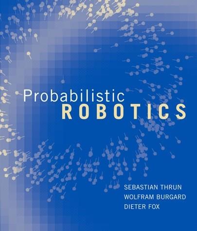

# State Estimation

-----

[TOC]

# 1. Probability Theory and Statistics

* MLE (Maximum Likelihood Estimate)
* OLS (Ordinary Least Squares)
* RANSAC (RANdom SAmple Consensus)
* M-Estimator

# 2. Filters

* KF (Kalman Filter)
* EKF (Extended Kalman Filter)

# 3. Optimization

## Basics

* Gauss Newton
* Levenberg-Marquadt
* ESM

## Optimizer

* [g2o](https://openslam-org.github.io/g2o.html): A General Framework for Graph Optimization
  - recommend version: commit id **ff647bd** (ff647bd7537860a2b53b3b774ea821a3170feb13)
  - [Ubuntu 16.04.1 :: error while trying to run g2o_viewer](https://github.com/RainerKuemmerle/g2o/issues/133#issuecomment-265894146)
  - [SLAM Implementation: Bundle Adjustment with g2o](https://fzheng.me/2016/03/15/g2o-demo/)
* [Ceres Solver](http://ceres-solver.org/): an open source C++ library for modeling and solving large, complicated optimization problems
  - [Ceres-Solver 从入门到上手视觉SLAM位姿优化问题](https://blog.csdn.net/u011178262/article/details/88774577)
* iSAM
* GTSAM

## Pose Graph

## Factor Graph

## Bundle Adjustment

* [Bundle adjustment (wikipedia)](https://en.wikipedia.org/wiki/Bundle_adjustment)
* [sba](http://users.ics.forth.gr/~lourakis/sba/): A Generic Sparse Bundle Adjustment C/C++ Package Based on the Levenberg-Marquardt Algorithm
* [cvsba](https://www.uco.es/investiga/grupos/ava/node/39): an OpenCV wrapper for sba library
* [sparseLM](http://users.ics.forth.gr/~lourakis/sparseLM/) : Sparse Levenberg-Marquardt nonlinear least squares in C/C++
* [Bundle Adjustment in the Large](http://grail.cs.washington.edu/projects/bal/)
* [Multicore Bundle Adjustment](http://grail.cs.washington.edu/projects/mcba/)

Sparse Hessian matrix :

  

# 4. Dataset

##  BAL Dataset

* Bundle Adjustment in the Large

##  g2o Dataset

* [g2o format datasets – Luca Carlone](https://lucacarlone.mit.edu/datasets/)
* sphere.g2o

# 5. Books

* ***[Probabilistic Robotics](http://www.probabilistic-robotics.org/)***
  - [pptacher/probabilistic_robotics](https://github.com/pptacher/probabilistic_robotics): solution of exercises of the book "probabilistic robotics"

  

