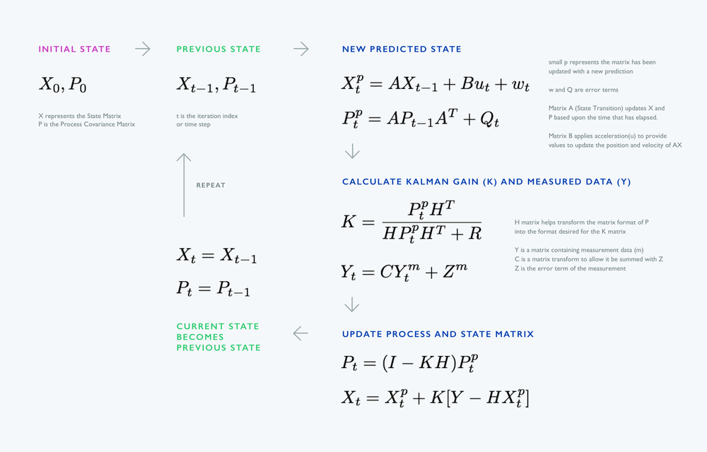

# Kalman Filter



-----


**Kalman filter equations**

```
    /*------------------------------------------*\
     |  Kalman model                              |
     |                                            |
     |  state quation                             |
     |  x(k) = A.x(k-1)+B.u(k)+w(k-1)             |
     |                                            |
     |  observations equation                     |
     |  z(k) = H.x(k)+y(k)                        |
     |                                            |
     |  prediction equations                      |
     |  x^(k) = A.x^(k-1) + B.u(k)                |
     |  P^(k) = A.P(k-1).A^T + Q                  |
     |                                            |
     |  correction equations                      |
     |  K(k) = P^(k).H^T . (H.P^(k).H^T + R)^-1   |
     |  x(k) = x^(k) + K(k).(z(k) - H*x^(k))      |
     |  P(k) = (I - K(k).H).P^(k)                 |
     |                                            |
     \*------------------------------------------*/
```
